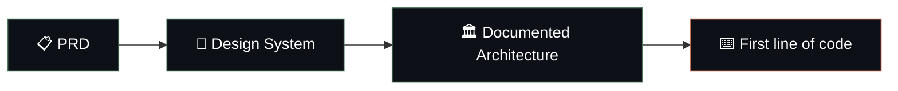
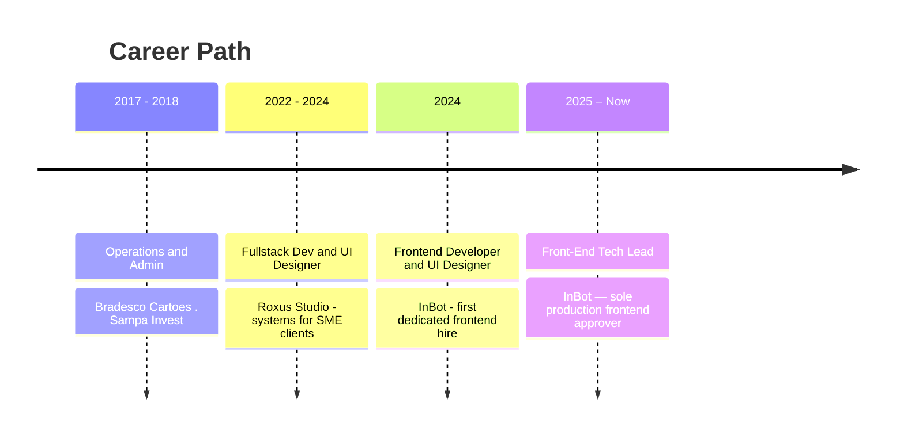

<h1>Matheus Mierzwa</h1>

<em>I build and lead fullstack systems end to end — from architecture to production.</em>

---

## 👋 About

I’m a **Fullstack Tech Lead** at a conversational AI startup, where I'm the **sole approver for all production frontend changes** across a multi-product monorepo. I own frontend architecture, infrastructure, and delivery — from auth systems and CI/CD to design systems and accessibility.

Outside of that, I design and ship **complete systems** for SME clients and open source: multi-tenant BaaS, self-hosted IAM, AI agent platforms, and developer tooling. Every system starts with a **PRD, a design system, and documented architecture** — before the first line of code.

> My edge is simple: **I think in systems, not features.**

---

## 🧠 How I Work

Every system I build follows the same discipline — design before code:

---

## 🛠️ Tech Arsenal

**Frontend**

**Backend & Data**

**Auth & IAM**

**Infra & DevOps**

**Quality & AI**

---

## 🚀 Featured Systems

> Self-designed, end-to-end systems — each starting from a PRD and documented architecture.

<table>
<tr>
<td width="50%" valign="top">

### 🗄️ [OliBase](https://github.com/MierzwaMatheus/OliBase)
**Multi-tenant BaaS** — auth, row-level security and scoped API keys. A self-hosted backend platform built as an honest, lean alternative to Firebase/Supabase.

`TypeScript` · `Multi-tenant` · `RLS` · `API Keys`

</td>
<td width="50%" valign="top">

### 🔐 [GateKey](https://github.com/MierzwaMatheus/gatekey)
**Self-hosted IAM platform** — RBAC, RS256 JWT, scoped API keys, audit logging, MFA, magic links and OAuth. Fine-grained access control without handing off your auth infra.

`TypeScript` · `Convex` · `RBAC` · `OAuth`

</td>
</tr>
<tr>
<td width="50%" valign="top">

### 🔨 [Code Forge](https://github.com/MierzwaMatheus/forge-code)
**Evidence-driven development** — open-source system for automated validation and AI-powered code auditing. Ships software backed by evidence, not vibes.

`TypeScript` · `AI Audit` · `Automation` · `GPL-3.0`

</td>
<td width="50%" valign="top">

### 🤖 [Tucano Agent](https://github.com/MierzwaMatheus/tucano-chat-agent)
**AI personal finance assistant** — conversational agent that tracks and reasons over your finances, powered by Gemini.

`React` · `Supabase` · `Gemini` · `Vite`

</td>
</tr>
<tr>
<td width="50%" valign="top">

### 💡 [IdeaForge](https://github.com/MierzwaMatheus/ideaforge-ia)
**Idea-to-project structuring** — turns raw ideas into structured projects through a panel of specialist AI agents.

`React` · `Firebase` · `Gemini` · `TypeScript`

</td>
<td width="50%" valign="top">

### ✍️ [Rubrica](https://github.com/MierzwaMatheus/rubrica)
**Portfolio-as-a-system** — full professional portfolio (home, blog, résumé, proposals, payments, admin). Fork it, brand it, ship it.

`React` · `Convex` · `Vercel` · `GPL-3.0`

</td>
</tr>
</table>

---

## 💼 Experience

<b>🏢 InBot — Front-End Tech Lead</b> · <i>Jan 2025 – Present</i>

 

Promoted to Tech Lead after driving the strategic evolution of the company's frontend architecture. I own architecture, infrastructure, and delivery across a multi-product monorepo as the **sole approver for all production frontend changes**.

- 🏛️ Architected a **company-wide authentication system**, migrating legacy flows to **Keycloak** with a custom user-management layer — enabling enterprise onboarding
- 🔗 Implemented **Microsoft Entra ID** via Keycloak Identity Broker, resolving a critical enterprise onboarding bottleneck
- 🚀 Designed and led adoption of **Vercel** as primary frontend infra; built **CI/CD from scratch** with GitHub Actions + Git Flow and staging environments
- ♿ Shipped **InTable 2.0** with full **WCAG accessibility** (ARIA roles, sorting, form patterns) and E2E automation — enabling enterprise adoption
- ✈️ Delivered a production widget for **Azul (LATAM Airlines)** on schedule, with reusable components adopted across teams
- 🌐 Delivered InBot's **2026 website** from scratch — SEO (meta tags, Open Graph) + AWS deploy, on time
- 🧠 Architected **InCity**, a no-code AI agent builder for non-technical users
- 👥 Built the company's **first structured frontend training program**

<b>🎨 InBot — UI Designer &amp; Frontend Developer</b> · <i>Nov 2024 – Jan 2025</i>

 

Joined as the **first dedicated frontend hire**, owning both UI/UX design and frontend implementation for the core admin platform — the foundation for my later promotion to Tech Lead.

- Led a full UX & visual redesign (~30% better perceived usability)
- Defined the company's **first design system** and visual style guide
- Drove adoption of **dark mode** as the primary product theme
- Introduced **AI-assisted development workflows** (~40% faster delivery)

<b>🧰 Roxus Studio — Fullstack Developer &amp; UI Designer</b> · <i>2022 – Nov 2024</i>

 

Independent studio building **end-to-end digital systems** for SME clients — product design, UI engineering, and fullstack development.

- Owned full project lifecycle (discovery → identity → deploy), **90%+ client satisfaction**
- Shipped fullstack **workshop management systems** (React, Vite, Tailwind, Convex) — in production since 2022
- Built reusable **TypeScript component libraries** (~25% faster delivery)
- Progressively shifted from UI/branding into **backend architecture and auth flows**

---

## 📊 GitHub Stats

 

---

## 🎓 Education & Certifications

- 🎓 **Technologist, IT Management** — FATEC Barueri *(2018 – 2023)*
- 🏫 **Technical Degree, Business & Administration** — ETEC São Paulo *(2015 – 2017)*
- 📜 RAG for Generative AI Applications · AI Fundamentals and the Cloud · Model Context Protocol (Advanced) · Vector Databases for RAG

---

🌎 <b>English</b> (Full Professional) · <b>Português</b> (Native) · <b>Español</b> (Limited Working)

  

